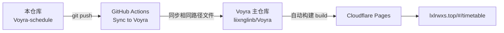

<div align="center">

# 🗓 Voyra · 日程中心 · Schedule Center

**一个页面搞定大学课程表与日程规划 ｜ Course schedule, weekly planner and calendar in one place**

[](https://github.com/liixnglinb/Voyra-schedule/actions/workflows/sync-to-voyra.yml)


### [🌐 在线演示 Live Demo](https://lxlrwxs.top/#/timetable) ｜ [🏠 Voyra 主站 Main Site](https://lxlrwxs.top) ｜ [📦 主仓库 Main Repo](https://github.com/liixnglinb/Voyra)

</div>

---

## ✨ 功能特性 / Features

### 课程表 / Class Schedule
- **周次自动定位**：根据开学日期自动计算并高亮当前教学周，支持手动切换周次。
  *Auto-locates the current teaching week from the semester start date, with manual week switching.*
- **智能连堂合并**：两节连上的课程自动合并为一个色块，网格整洁直观。
  *Consecutive periods of the same course are merged into one block.*
- **完整信息展示**：课程名、上课教师（含「副教授/讲师」等完整职称）、上课教室一并显示。
  *Shows course name, teacher with full academic title, and classroom together.*
- **课程明细默认折叠**：网格保持清爽，点击课程卡片再展开全部周次与明细。
  *Details collapse by default; tap a card to expand weeks and full info.*
- **作息时间自定义**：每节课与晚自习的起止时间均可调节，采用主流滚轮时间选择器。
  *Fully editable period/evening-study times with a wheel-style time picker.*

### 三种导入方式 / Three Import Modes
- **教务 XLS 导入**：直接解析教务系统导出的网格课表，自动识别「2-17周 / 单双周 / 连堂 / 教室 / 教师职称」等混写格式（基于 SheetJS）。
  *Parses registrar-exported XLS grids, including mixed week ranges, odd/even weeks, merged periods and classrooms (SheetJS).*
- **文字识别导入**：粘贴课程文本即可智能拆分课程、周次、节次与地点。
  *Paste plain course text and auto-split name / weeks / periods / location.*
- **手动添加**：表单逐项录入，灵活补建。
  *Manual entry form for edge cases.*

### 日程规划 / Planner & Calendar
- 今日概览、待办清单、自定义事项；月历视图并标注法定节假日。
  *Today overview, to-do list, custom events, month calendar with public holidays.*

## 🛠 技术栈 / Tech Stack

| 类别 Category | 技术 Stack |
| --- | --- |
| 框架 Framework | React 18（函数组件 + Hooks） |
| 构建 Build | Vite 5 |
| 样式 Styling | Tailwind CSS |
| 表格解析 XLS | SheetJS（xlsx） |
| 数据存储 Storage | localStorage（+ Voyra 共享 Bmob 云端层） |
| 图标 Icons | lucide-react |

## 📁 目录结构 / Structure

```
src/
└── pages/
    ├── ScheduleHub.jsx      # 日程中心入口与聚合 / Hub entry & tabs
    ├── ClassSchedule.jsx    # 课表网格 + XLS/文本解析器 / Grid + parsers
    └── Planner.jsx          # 日程规划与日历 / Planner & calendar
```

## 🔗 与 Voyra 主仓库的关系 / How It Syncs

本仓库是 Voyra 个人工具中心「日程中心」模块的**独立源码仓库**：代码在本仓库维护，每次 `push` 由 GitHub Actions 自动同步到 Voyra 主仓库的相同路径，主仓库统一构建并部署到 Cloudflare Pages，域名、路由与数据均无需改动。

*This is the standalone source repo of the Schedule Center module. Every push is auto-synced into the main Voyra repository at the same paths; the main repo builds and deploys the whole site to Cloudflare Pages.*



## 🚀 本地开发 / Development

模块依赖主仓库的共享层（路由、鉴权、Bmob、通用 UI 组件），因此本仓库用于**展示、被 GitHub 搜索与自动同步**；需要完整运行时请克隆主仓库：

*The module depends on the main repo's shared layer (router, auth, Bmob, common UI). Clone the main repo to run it locally:*

```bash
git clone https://github.com/liixnglinb/Voyra.git
cd Voyra
npm install
npm run dev
```

修改本模块文件后，在本仓库提交推送即可自动同步上线。

*Edit the module files, commit and push here — the site updates automatically.*

## 📄 许可证 / License

MIT © [liixnglinb](https://github.com/liixnglinb)

## 🔍 关键词 / Keywords

课程表 课表 大学 教务系统 XLS课表导入 单双周 日程 规划 日历 时间表 React ｜ schedule timetable planner calendar university course xlsx-import react vite
